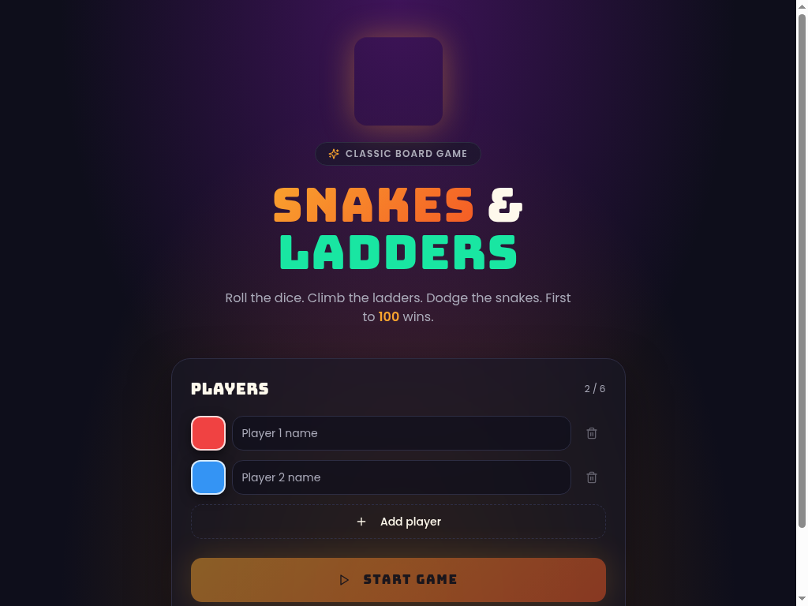
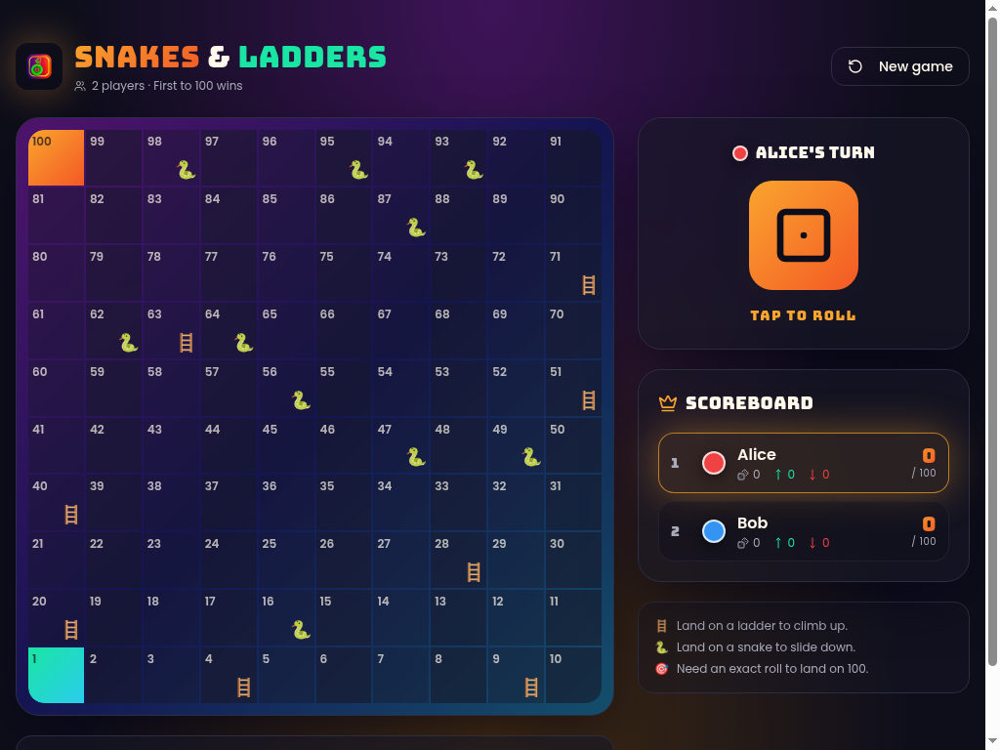

# 🐍 Snakes & Ladders 🪜

A modern, beautifully crafted **Snakes & Ladders** game built with React, Vite, TypeScript, and Tailwind CSS. Play locally with **2–6 players**, roll the animated dice, climb ladders, dodge snakes, and race to **100**!

> 100% frontend — no backend, no signup, just open and play.

---

## ✨ Features

- 🎮 **2–6 local players** with custom names and color tokens
- 🎲 **Animated dice** with smooth roll cycling
- 🪜 **Ladders & 🐍 snakes** with toast notifications on every event
- 🏆 **Live scoreboard** tracking rolls, ladders climbed, and snakes bitten
- 🎯 **Exact-roll-to-win** rule (must land precisely on 100)
- 📱 **Fully responsive** layout — works on phones, tablets, and desktops
- 🌙 **Bold dark theme** with custom typography (Bungee + Poppins)
- ⚡ **Optimized SEO** with meta tags, OpenGraph, and JSON-LD schema

---

## 📸 Screenshots

### Player Setup


### Gameplay


---

## 🚀 Project Setup

### Prerequisites
- **Node.js** 18+ (or [Bun](https://bun.sh) — recommended)
- **npm**, **pnpm**, or **bun**

### Installation

```bash
# 1. Clone the repository
git clone <YOUR_REPO_URL>
cd <YOUR_PROJECT_FOLDER>

# 2. Install dependencies
npm install
# or: bun install

# 3. Start the dev server
npm run dev
# or: bun run dev
```

The app will be available at **http://localhost:8080**.

### Build for production

```bash
npm run build
npm run preview   # locally preview the production build
```

---

## 🎯 How to Play

1. Enter **2 to 6 player names** and pick a color for each.
2. Click **START GAME**.
3. On your turn, **tap the dice** to roll.
4. 🪜 Land on a ladder → climb up.
5. 🐍 Land on a snake → slide down.
6. 🎯 First player to land **exactly on 100** wins!

---

## 🛠️ Tech Stack

| Layer        | Tech                                       |
|--------------|--------------------------------------------|
| Framework    | React 18 + Vite 5                          |
| Language     | TypeScript 5                               |
| Styling      | Tailwind CSS v3 + custom design tokens     |
| UI Kit       | shadcn/ui + Radix primitives               |
| Icons        | lucide-react                               |
| Notifications| sonner                                     |
| Fonts        | Bungee (display) + Poppins (body)          |

---

## 📂 Project Structure

```
src/
├── assets/              # Logo and static images
├── components/
│   ├── Board.tsx        # 10x10 game board
│   ├── Dice.tsx         # Animated dice
│   ├── PlayerSetup.tsx  # Player entry screen
│   ├── Scoreboard.tsx   # Live leaderboard
│   └── ui/              # shadcn/ui primitives
├── game/
│   └── constants.ts     # Snakes, ladders & helpers
├── pages/
│   ├── Index.tsx        # Main game loop
│   └── NotFound.tsx
├── index.css            # Design tokens & animations
└── main.tsx             # App entry
```

---

## 📜 License

MIT — free to use, modify, and share. Have fun! 🎉
